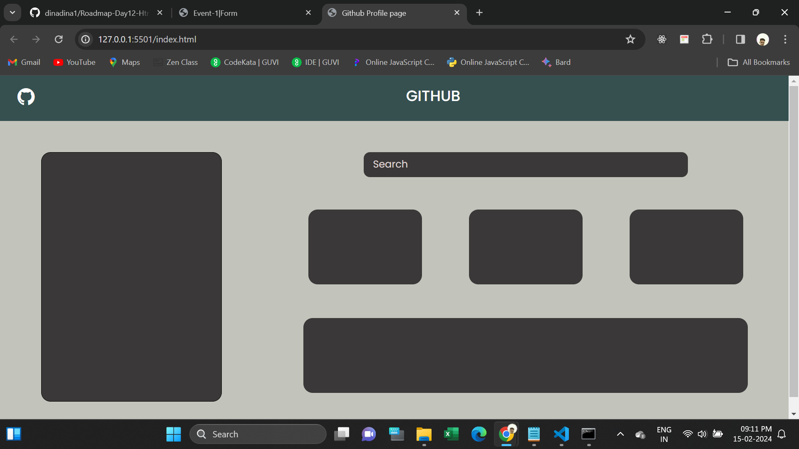

<h1>Github Profile Page</h1>

This webpage is Github Profile page design.

Its represents some section alignment for arranging content.

I used to Html, CSS, Bootstrap for developing this page with Responsive.

It will take 100% width in mobiles.

I attached the Screenshot below.
 
<h2>Deployed URL</h2>
https://github-profilepages.netlify.app/ 
<h2>Screenshot</h2>

